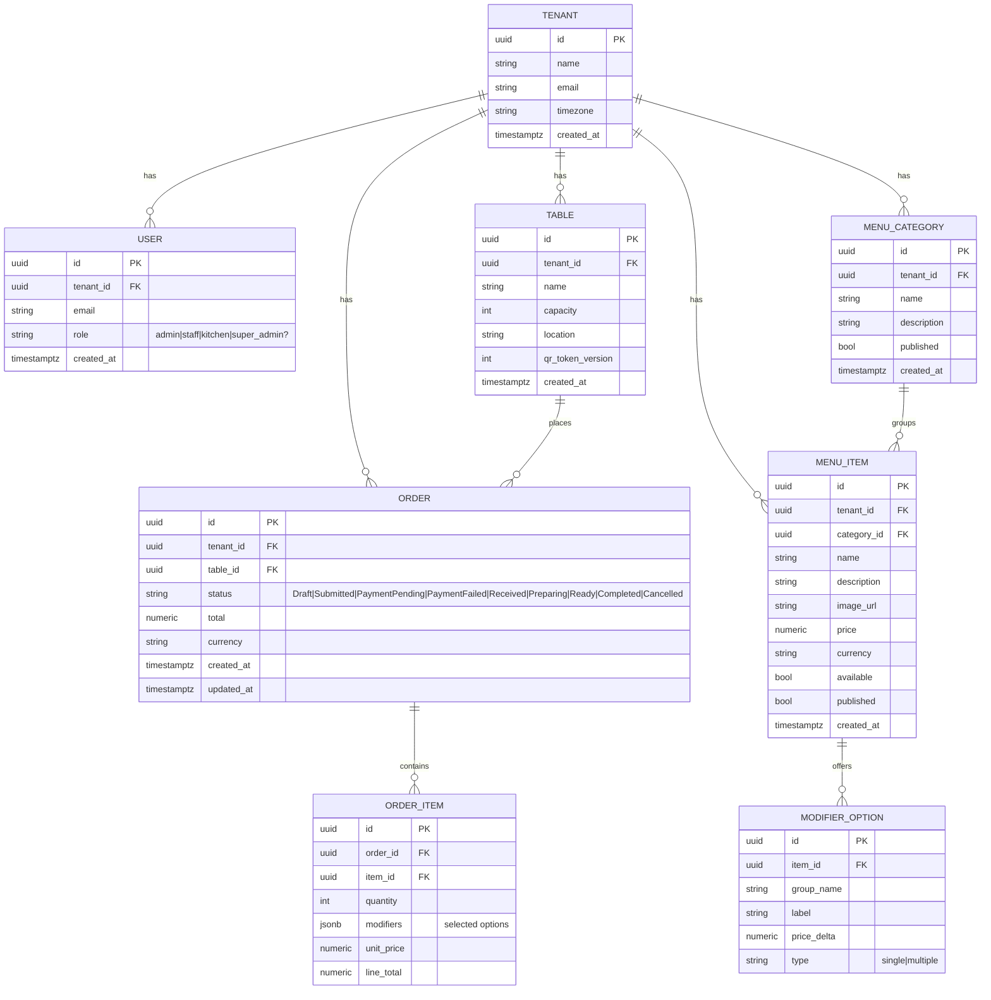

# ER Diagram (MVP)

Notes

- All tenant-owned tables include `tenant_id` (enforced by RLS, see ADR-0001).
- `TABLE.qr_token_version` increments on regenerate to invalidate old tokens.
- Prices stored as numeric; consider minor-unit integer for precision (future ADR).

Related

- SRS FR-3/4/5/6, OpenAPI schemas, Order state machine diagram.
