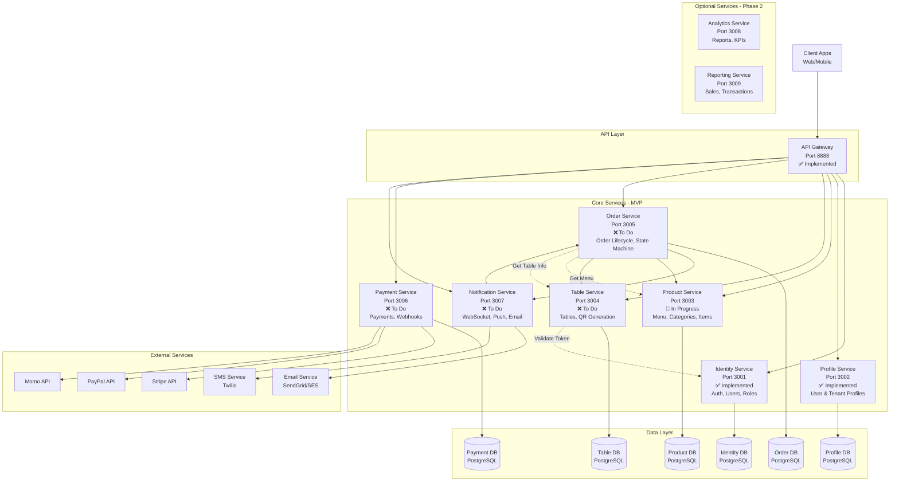

# Kiến trúc Microservices - Smart Restaurant

**Version:** 1.0  
**Date:** December 6, 2025  
**Author:** Architecture Team

---

## 1. Tổng quan kiến trúc

Hệ thống Smart Restaurant được thiết kế theo mô hình **Microservices** với **8 services chính** để đảm bảo:
- Khả năng mở rộng độc lập
- Dễ bảo trì và phát triển
- Phân tách trách nhiệm rõ ràng
- Hỗ trợ multi-tenant

---

## 2. Sơ đồ kiến trúc tổng quan



---

## 3. Chi tiết từng service

### 3.1. API Gateway (✅ Đã thực hiện)
**Port:** 8888  
**Tech Stack:** NestJS  
**Trách nhiệm:**
- Entry point duy nhất cho tất cả requests
- Routing requests đến các services tương ứng
- Authentication & Authorization (JWT validation)
- Rate limiting
- Request/Response transformation
- Logging & monitoring

**Endpoints chính:**
- `/api/v1/auth/*` → Identity Service
- `/api/v1/profile/*` → Profile Service
- `/api/v1/menu/*` → Product Service
- `/api/v1/tables/*` → Table Service
- `/api/v1/orders/*` → Order Service
- `/api/v1/payments/*` → Payment Service

---

### 3.2. Identity Service (✅ Đã thực hiện)
**Port:** 3001  
**Tech Stack:** NestJS + PostgreSQL  
**Database:** identity_db

**Trách nhiệm:**
- User authentication (login/logout)
- JWT token generation & validation
- User management (CRUD)
- Role-based access control (RBAC)
- Permission management
- Super Admin operations

**Entities:**
- `User` - Thông tin user (email, password hash, role)
- `Role` - Roles (super_admin, tenant_admin, staff, kitchen)
- `Authority` - Permissions/authorities
- `RemoveToken` - Blacklist tokens

**API Endpoints:**
- `POST /auth/login` - Đăng nhập
- `POST /auth/logout` - Đăng xuất
- `GET /auth/me` - Get current user info
- `POST /users/register` - Đăng ký user
- `GET /users` - List users
- `GET /roles` - List roles
- `POST /roles` - Create role
- `GET /authorities` - List authorities

---

### 3.3. Profile Service (✅ Đã thực hiện)
**Port:** 3002  
**Tech Stack:** NestJS + PostgreSQL  
**Database:** profile_db

**Trách nhiệm:**
- Quản lý user profiles
- Quản lý tenant profiles (restaurant info)
- Tenant settings (timezone, currency, opening hours)
- Tenant onboarding status

**Entities:**
- `Profile` - User profile information
- Có thể extend thêm `TenantProfile` cho restaurant info

**API Endpoints:**
- `GET /profile/:id` - Get profile
- `PUT /profile/:id` - Update profile
- `POST /tenant-profile` - Create tenant profile
- `GET /tenant-profile/:tenantId` - Get tenant profile

---

### 3.4. Product Service (🔄 Đang thực hiện)
**Port:** 3003  
**Tech Stack:** NestJS + PostgreSQL  
**Database:** product_db

**Trách nhiệm:**
- Quản lý menu categories
- Quản lý menu items
- Quản lý modifiers (size, extras, toppings)
- Publish/unpublish menu
- Menu availability management
- Pricing management

**Entities:**
- `MenuCategory` - Danh mục món ăn
  - `id`, `tenant_id`, `name`, `description`, `published`, `display_order`
- `MenuItem` - Món ăn
  - `id`, `tenant_id`, `category_id`, `name`, `description`, `price`, `currency`, `image_url`, `available`, `published`
- `ModifierGroup` - Nhóm modifier (Size, Toppings, etc.)
  - `id`, `item_id`, `name`, `type` (single/multiple), `required`
- `ModifierOption` - Tùy chọn modifier
  - `id`, `group_id`, `label`, `price_delta`

**API Endpoints:**
- `GET /tenants/:tenantId/menu/categories` - List categories
- `POST /tenants/:tenantId/menu/categories` - Create category
- `PUT /categories/:id` - Update category
- `DELETE /categories/:id` - Delete category
- `POST /categories/:id/publish` - Publish category
- `GET /tenants/:tenantId/menu/items` - List items
- `POST /tenants/:tenantId/menu/items` - Create item
- `PUT /items/:id` - Update item
- `DELETE /items/:id` - Delete item
- `POST /items/:id/modifiers` - Add modifier group
- `GET /public/menu/:tenantId` - Public menu (for customers)

**Business Rules:**
- Categories có thể publish/unpublish độc lập
- Items chỉ hiển thị khi cả item và category đều published
- Modifiers có thể required hoặc optional
- Price có thể set ở item level và modifier level (price_delta)

---

### 3.5. Table Service (❌ Cần thực hiện - QUAN TRỌNG)
**Port:** 3004  
**Tech Stack:** NestJS + PostgreSQL  
**Database:** table_db

**Trách nhiệm:**
- Quản lý bàn (tables)
- QR code generation
- QR token signing & validation
- QR regeneration (invalidate old tokens)
- Table status management

**Entities:**
- `Table` - Bàn
  - `id`, `tenant_id`, `name`, `capacity`, `location`, `status` (active/inactive), `qr_token_version`, `created_at`
- `QRToken` - Metadata của QR tokens (optional cache)
  - `table_id`, `token_version`, `created_at`, `expires_at`

**API Endpoints:**
- `GET /tenants/:tenantId/tables` - List tables
- `POST /tenants/:tenantId/tables` - Create table
- `PUT /tables/:id` - Update table info
- `DELETE /tables/:id` - Deactivate table
- `POST /tables/:id/qr/generate` - Generate/Regenerate QR code
- `GET /public/scan/:token` - Validate QR token (public endpoint)

**QR Token Structure:**
```json
{
  "tenantId": "uuid",
  "tableId": "uuid",
  "version": 1,
  "iat": 1234567890,
  "exp": 1234567890
}
```

**Business Rules:**
- QR token được ký bằng HMAC-SHA256 với secret key
- Token version tăng lên mỗi khi regenerate
- Old tokens bị invalidate ngay lập tức khi regenerate
- Token có expiry time (default 1 năm)
- Validate token cần check: signature, expiry, version match với DB

**Communication:**
- Call Identity Service để validate tenant exists
- Provide token validation cho Order Service

---

### 3.6. Order Service (❌ Cần thực hiện - CORE FEATURE)
**Port:** 3005  
**Tech Stack:** NestJS + PostgreSQL + WebSocket  
**Database:** order_db

**Trách nhiệm:**
- Quản lý order lifecycle
- Order state machine implementation
- Order items với modifiers
- Real-time order updates
- Order history & audit trail
- KPI tracking (time-to-serve)

**Entities:**
- `Order` - Đơn hàng
  - `id`, `tenant_id`, `table_id`, `status`, `total`, `currency`, `customer_name`, `customer_phone`, `notes`, `created_at`, `updated_at`, `completed_at`
- `OrderItem` - Chi tiết món trong đơn
  - `id`, `order_id`, `item_id`, `item_name`, `quantity`, `unit_price`, `line_total`, `modifiers` (JSONB)
- `OrderStatusHistory` - Lịch sử chuyển trạng thái
  - `id`, `order_id`, `from_status`, `to_status`, `changed_by`, `changed_at`, `reason`

**Order Status Flow:**
```
Draft → Submitted → PaymentPending → (PaymentFailed|Received) 
     → Preparing → Ready → Completed
     → Cancelled (có thể từ nhiều states)
```

**API Endpoints:**
- `POST /orders` - Create order (from customer cart)
- `GET /orders/:id` - Get order details
- `GET /tenants/:tenantId/orders` - List orders (for staff)
- `PATCH /orders/:id/status` - Update order status
- `POST /orders/:id/cancel` - Cancel order
- `GET /orders/:id/history` - Get status history
- `WS /orders/subscribe/:tenantId` - WebSocket subscription for real-time updates

**Business Rules:**
- State transitions phải follow state machine rules (xem diagram)
- Chỉ staff mới được update status từ Received onwards
- Customer chỉ có thể cancel ở trạng thái Draft/Submitted
- Timer bắt đầu khi order chuyển sang Preparing
- Notification trigger khi order status thay đổi

**Communication:**
- Call Product Service để get menu item info & validate items
- Call Table Service để validate table token
- Call Payment Service để check payment status
- Push events đến Notification Service khi status changes

---

### 3.7. Payment Service (❌ Cần thực hiện - CORE FEATURE)
**Port:** 3006  
**Tech Stack:** NestJS + PostgreSQL  
**Database:** payment_db

**Trách nhiệm:**
- Payment intent creation
- Payment gateway integration (Stripe, PayPal, Momo)
- Webhook handling (idempotent)
- Payment status tracking
- Refund processing
- Bill-to-table support

**Entities:**
- `Payment` - Thanh toán
  - `id`, `order_id`, `tenant_id`, `amount`, `currency`, `method` (card/cash/bill-to-table), `status` (pending/completed/failed/refunded), `provider` (stripe/paypal/momo), `provider_transaction_id`, `created_at`, `updated_at`
- `PaymentIntent` - Payment intent metadata
  - `id`, `payment_id`, `intent_id`, `client_secret`, `expires_at`
- `Refund` - Hoàn tiền
  - `id`, `payment_id`, `amount`, `reason`, `status`, `created_at`

**API Endpoints:**
- `POST /payments/intent` - Create payment intent
- `GET /payments/:id` - Get payment status
- `POST /payments/:id/confirm` - Confirm payment
- `POST /payments/:id/refund` - Process refund
- `POST /webhooks/stripe` - Stripe webhook
- `POST /webhooks/paypal` - PayPal webhook
- `POST /webhooks/momo` - Momo webhook

**Business Rules:**
- Payment intent expires sau 30 phút
- Webhook phải idempotent (check duplicate events)
- Failed payment có thể retry
- Refund chỉ available cho completed payments
- Bill-to-table tạo payment record với status pending

**Communication:**
- Update Order Service khi payment status thay đổi
- External calls to Stripe/PayPal/Momo APIs

---

### 3.8. Notification Service (❌ Cần thực hiện - QUAN TRỌNG)
**Port:** 3007  
**Tech Stack:** NestJS + WebSocket + Redis (for pub/sub)  
**Database:** Không cần persistent DB (hoặc dùng chung với Order DB)

**Trách nhiệm:**
- WebSocket server cho real-time updates
- Push notifications (browser push)
- Email notifications
- SMS notifications (optional)
- Event broadcasting

**Notification Types:**
- **Staff notifications:**
  - New order received
  - Order cancelled by customer
- **Customer notifications:**
  - Order confirmed
  - Order preparing
  - Order ready for pickup
  - Payment success/failure

**API Endpoints:**
- `WS /ws/staff/:tenantId` - WebSocket for staff
- `WS /ws/customer/:orderId` - WebSocket for customers
- `POST /notifications/email` - Send email
- `POST /notifications/sms` - Send SMS
- `POST /notifications/push` - Send push notification

**Communication:**
- Subscribe to events from Order Service
- Subscribe to events from Payment Service
- Call Email Provider (SendGrid/SES)
- Call SMS Provider (Twilio)

---

## 4. Service Communication Patterns

### 4.1. Synchronous (HTTP/gRPC)
- API Gateway → Services (HTTP REST)
- Service-to-Service queries (gRPC hoặc HTTP)

### 4.2. Asynchronous (Event-driven)
- Order Service → Notification Service (events)
- Payment Service → Order Service (webhook events)

### 4.3. Real-time (WebSocket)
- Order updates → Staff Dashboard
- Order status → Customer App

---

## 5. Database Strategy

### Multi-tenant Data Isolation
Sử dụng **Row-Level Security (RLS)** với PostgreSQL:
- Mỗi service có database riêng
- Mỗi table có column `tenant_id`
- RLS policies enforce tenant isolation
- Connection pooling per tenant (optional)

**Alternative:** Schema-per-tenant (có thể consider cho production)

---

## 6. Inter-Service Authentication

### Service-to-Service Auth
- Option 1: **Mutual TLS (mTLS)** - Best for production
- Option 2: **API Keys** - Simpler for development
- Option 3: **JWT with Service Account** - Balance between security & complexity

**Recommendation:** Start with API Keys, migrate to mTLS in production

---

## 7. Deployment & Scaling

### Container Strategy
- Mỗi service = 1 Docker container
- Docker Compose cho local development
- Kubernetes cho production

### Scaling Priority
1. **Order Service** - Most critical, handle high load
2. **Notification Service** - WebSocket connections
3. **Payment Service** - Transaction safety
4. **Product Service** - Read-heavy, cache aggressively
5. **Table Service** - Relatively stable
6. **Identity Service** - Cache user info
7. **Profile Service** - Low traffic

---

## 8. Implementation Roadmap

### Phase 1: MVP (Current Sprint)
1. ✅ Identity Service
2. ✅ Profile Service
3. ✅ API Gateway
4. 🔄 Product Service (In Progress)
5. ❌ Table Service (Next)
6. ❌ Order Service (Critical)
7. ❌ Payment Service (Critical)
8. ❌ Notification Service (Important)

### Phase 2: Enhancement
9. Analytics Service
10. Reporting Service
11. Advanced features (loyalty, promotions)

---

## 9. Testing Strategy

### Unit Tests
- Each service: 80% code coverage minimum
- Mock external dependencies

### Integration Tests
- Test service-to-service communication
- Test database transactions

### E2E Tests
- Critical flows:
  1. QR scan → Order → Payment → Kitchen
  2. Admin create menu → Publish → Customer sees
  3. Order lifecycle: Received → Preparing → Ready → Completed

### Performance Tests
- 1000 concurrent users per tenant
- WebSocket connection load testing
- Database query optimization

---

## 10. Monitoring & Observability

### Metrics to Track
- Request rate per service
- Response time (P50, P95, P99)
- Error rate (4xx, 5xx)
- Database connection pool usage
- WebSocket active connections
- Order processing time (KPI)

### Logging
- Structured logging (JSON format)
- Correlation IDs across services
- Log aggregation (ELK/CloudWatch)

### Tracing
- Distributed tracing (Jaeger/Zipkin)
- Trace order flow across services

---

## 11. Security Considerations

### Authentication & Authorization
- JWT tokens với short expiry (15 minutes)
- Refresh tokens (7 days)
- Role-based access control (RBAC)
- API Gateway validates JWT before routing

### Data Protection
- HTTPS/TLS for all communications
- Database encryption at rest
- Sensitive data masking in logs
- PII data minimization

### QR Token Security
- HMAC-SHA256 signing
- Token versioning for revocation
- Expiry time enforcement
- Rate limiting on public endpoints

---

## 12. Next Steps

### Immediate Actions
1. **Complete Product Service** implementation
2. **Start Table Service** development
   - QR generation logic
   - Token signing/validation
3. **Design Order Service** state machine implementation
4. **Setup Payment Service** with Stripe sandbox

### Documentation Needed
1. API documentation (Swagger/OpenAPI) cho mỗi service
2. Service deployment guide
3. Database migration strategy
4. Incident response runbook

---

## 13. Decision Log

### ADR-001: Multi-tenant Data Isolation
**Decision:** Row-Level Security (RLS) with tenant_id column  
**Rationale:** Simpler than schema-per-tenant, easier to manage, good enough for MVP  
**Trade-offs:** Less isolation than separate schemas, but more cost-effective

### ADR-002: Service Communication
**Decision:** HTTP REST for MVP, consider gRPC for high-traffic services later  
**Rationale:** Easier to debug, widely supported, good tooling  
**Trade-offs:** Less efficient than gRPC, but acceptable for MVP load

### ADR-003: Real-time Updates
**Decision:** WebSocket for order updates  
**Rationale:** True real-time, lower latency than polling  
**Trade-offs:** More complex infrastructure, need connection management

### ADR-004: Payment Gateway
**Decision:** Start with Stripe, add PayPal/Momo later  
**Rationale:** Best documentation, easiest integration, widely used  
**Trade-offs:** Vendor lock-in, but can add others incrementally

---

## Appendix A: Service Port Mapping

| Service | Port | Status | Database |
|---------|------|--------|----------|
| API Gateway | 8888 | ✅ Done | N/A |
| Identity Service | 3001 | ✅ Done | identity_db |
| Profile Service | 3002 | ✅ Done | profile_db |
| Product Service | 3003 | 🔄 In Progress | product_db |
| Table Service | 3004 | ❌ To Do | table_db |
| Order Service | 3005 | ❌ To Do | order_db |
| Payment Service | 3006 | ❌ To Do | payment_db |
| Notification Service | 3007 | ❌ To Do | N/A (Redis) |
| Analytics Service | 3008 | 📋 Future | analytics_db |
| Reporting Service | 3009 | 📋 Future | reporting_db |

---

## Appendix B: Technology Stack Summary

| Component | Technology |
|-----------|------------|
| Backend Framework | NestJS (Node.js + TypeScript) |
| API Gateway | NestJS + Express |
| Database | PostgreSQL 14+ |
| Cache/Pub-Sub | Redis |
| Real-time | WebSocket (Socket.io) |
| Message Queue | RabbitMQ/Redis Streams (optional) |
| Auth | JWT + Passport.js |
| Payment | Stripe SDK, PayPal SDK |
| Email | SendGrid / AWS SES |
| SMS | Twilio |
| Logging | Winston + ELK Stack |
| Monitoring | Prometheus + Grafana |
| Tracing | Jaeger |
| Container | Docker |
| Orchestration | Docker Compose (dev) / Kubernetes (prod) |
| CI/CD | GitHub Actions |
| Cloud | AWS / GCP (TBD) |

---

**End of Document**
