# Service Architecture Diagram

## Visual Service Map

```mermaid
graph TB
    subgraph "Client Layer"
        WebApp[Web App]
        Mobile[Mobile App]
        AdminPanel[Admin Panel]
    end

    subgraph "API Gateway Layer - Port 8888"
        Gateway[API Gateway ✅<br/>Routing, Auth, Rate Limiting]
    end

    subgraph "Core Services - MVP Phase"
        subgraph "Auth & User Management"
            Identity[Identity Service ✅<br/>Port 3001<br/>Auth, Users, Roles, JWT]
            Profile[Profile Service ✅<br/>Port 3002<br/>User & Tenant Profiles]
        end

        subgraph "Menu & Table Management"
            Product[Product Service 🔄<br/>Port 3003<br/>Menu, Categories, Items, Modifiers]
            Table[Table Service ❌<br/>Port 3004<br/>Tables, QR Generation & Validation]
        end

        subgraph "Order & Payment Processing"
            Order[Order Service ❌<br/>Port 3005<br/>Order Lifecycle, State Machine<br/>WebSocket Updates]
            Payment[Payment Service ❌<br/>Port 3006<br/>Stripe, PayPal, Momo<br/>Webhook Handler]
        end

        subgraph "Communication"
            Notification[Notification Service ❌<br/>Port 3007<br/>WebSocket, Email, SMS, Push]
        end
    end

    subgraph "Optional Services - Phase 2"
        Analytics[Analytics Service 📋<br/>Port 3008<br/>KPIs, Reports, Dashboards]
        Reporting[Reporting Service 📋<br/>Port 3009<br/>Sales, Transactions Export]
    end

    subgraph "Databases"
        IdentityDB[(Identity DB)]
        ProfileDB[(Profile DB)]
        ProductDB[(Product DB)]
        TableDB[(Table DB)]
        OrderDB[(Order DB)]
        PaymentDB[(Payment DB)]
        Redis[(Redis<br/>Cache & PubSub)]
    end

    subgraph "External Services"
        Stripe[Stripe API]
        PayPal[PayPal API]
        Momo[Momo API]
        SendGrid[SendGrid/SES]
        Twilio[Twilio SMS]
    end

    %% Client to Gateway
    WebApp --> Gateway
    Mobile --> Gateway
    AdminPanel --> Gateway

    %% Gateway to Services
    Gateway --> Identity
    Gateway --> Profile
    Gateway --> Product
    Gateway --> Table
    Gateway --> Order
    Gateway --> Payment
    Gateway --> Notification

    %% Services to Databases
    Identity --> IdentityDB
    Profile --> ProfileDB
    Product --> ProductDB
    Table --> TableDB
    Order --> OrderDB
    Payment --> PaymentDB
    Notification --> Redis

    %% Service to Service Communication
    Table -.->|Validate Tenant| Identity
    Order -.->|Get Menu Items| Product
    Order -.->|Validate Table Token| Table
    Order -.->|Check Payment| Payment
    Order -->|Emit Events| Notification
    Payment -->|Payment Status| Order
    Notification -->|WebSocket| WebApp
    Notification -->|WebSocket| Mobile

    %% External Integrations
    Payment --> Stripe
    Payment --> PayPal
    Payment --> Momo
    Notification --> SendGrid
    Notification --> Twilio

    %% Analytics (Future)
    Analytics -.->|Read Only| OrderDB
    Analytics -.->|Read Only| PaymentDB
    Reporting -.->|Read Only| OrderDB

    style Gateway fill:#a5d8ff
    style Identity fill:#b2f2bb
    style Profile fill:#b2f2bb
    style Product fill:#ffe066
    style Table fill:#ffc9c9
    style Order fill:#ffc9c9
    style Payment fill:#ffc9c9
    style Notification fill:#ffc9c9
    style Analytics fill:#e9ecef
    style Reporting fill:#e9ecef
```



## Legend
- ✅ **Implemented** - Đã hoàn thành
- 🔄 **In Progress** - Đang thực hiện
- ❌ **To Do** - Cần thực hiện (MVP)
- 📋 **Future** - Dự định tương lai (Phase 2)

---

## Service Communication Matrix

| From Service | To Service | Protocol | Purpose |
|--------------|------------|----------|---------|
| API Gateway | All Services | HTTP/REST | Route requests |
| Order | Product | HTTP | Get menu item details |
| Order | Table | HTTP | Validate table token |
| Order | Payment | HTTP | Check payment status |
| Order | Notification | Event/Message | Notify status changes |
| Payment | Order | Webhook/Event | Update payment status |
| Table | Identity | HTTP | Validate tenant exists |
| Notification | External APIs | HTTP | Send email/SMS |
| All Services | Redis | TCP | Cache & Pub/Sub |

---

## Critical Data Flows

### Flow 1: Customer Orders via QR
```
1. Customer scans QR → Table Service validates token
2. Customer views menu → Product Service returns menu
3. Customer creates order → Order Service creates order (Draft)
4. Customer checkouts → Order Service → Submitted
5. Payment initiated → Payment Service → PaymentPending
6. Payment succeeds → Payment Service → Order Service (Received)
7. Staff notified → Notification Service → WebSocket push
8. Staff accepts → Order Service (Preparing)
9. Order ready → Order Service (Ready) → Notification → Customer
10. Order completed → Order Service (Completed)
```

### Flow 2: Admin Manages Menu
```
1. Admin creates category → Product Service → ProductDB
2. Admin adds items → Product Service → ProductDB
3. Admin adds modifiers → Product Service → ProductDB
4. Admin publishes menu → Product Service updates published flag
5. Customers see updated menu → Product Service public endpoint
```

### Flow 3: QR Code Generation
```
1. Admin creates table → Table Service → TableDB
2. Admin requests QR → Table Service generates signed token
3. Token includes: tenantId, tableId, version, expiry
4. QR image generated (PNG/SVG) with embedded URL
5. Admin prints QR → Places on table
6. Customer scans → Table Service validates token → Redirects to menu
```

---

## Database Schema per Service

### Identity Service DB
```sql
-- Users, Roles, Authorities, RemoveToken
tenant_id (for multi-tenant users)
```

### Profile Service DB
```sql
-- UserProfile, TenantProfile
tenant_id
```

### Product Service DB
```sql
-- MenuCategory, MenuItem, ModifierGroup, ModifierOption
tenant_id (all tables)
```

### Table Service DB
```sql
-- Table
tenant_id, qr_token_version
```

### Order Service DB
```sql
-- Order, OrderItem, OrderStatusHistory
tenant_id
```

### Payment Service DB
```sql
-- Payment, PaymentIntent, Refund
tenant_id, order_id
```

---

## Deployment Architecture

```
┌─────────────────────────────────────────────────────────┐
│                     Load Balancer                       │
└────────────────────┬────────────────────────────────────┘
                     │
        ┌────────────┴────────────┐
        │                         │
   ┌────▼─────┐           ┌───────▼──────┐
   │ Gateway  │           │  Gateway     │
   │ Instance │           │  Instance    │
   └────┬─────┘           └───────┬──────┘
        │                         │
        └────────────┬────────────┘
                     │
     ┌───────────────┼───────────────────────┐
     │               │                       │
┌────▼────┐    ┌─────▼─────┐         ┌──────▼─────┐
│Identity │    │  Product  │   ...   │   Order    │
│Service  │    │  Service  │         │  Service   │
│(3 pods) │    │ (5 pods)  │         │  (10 pods) │
└────┬────┘    └─────┬─────┘         └──────┬─────┘
     │               │                      │
     ▼               ▼                      ▼
┌────────────────────────────────────────────────┐
│         PostgreSQL Cluster (RDS/CloudSQL)      │
└────────────────────────────────────────────────┘
```

---

## Recommended Service Implementation Order

### Sprint 1-2: Foundation (✅ DONE)
1. API Gateway
2. Identity Service
3. Profile Service

### Sprint 3: Current Sprint (🔄 IN PROGRESS)
4. Product Service

### Sprint 4-5: Core Features (❌ CRITICAL)
5. Table Service (QR functionality)
6. Order Service (Order lifecycle)

### Sprint 6: Payments (❌ CRITICAL)
7. Payment Service (Stripe integration)
8. Notification Service (WebSocket + Email)

### Sprint 7-8: Testing & Polish
- Integration tests
- E2E tests
- Performance optimization
- Security hardening

### Phase 2: Analytics & Reporting
9. Analytics Service
10. Reporting Service

---

## References
- Main Architecture Doc: `ARCHITECTURE.md`
- ER Diagram: `ER_DIAGRAM.md`
- API Spec: `../02-api/openapi.yaml`
- User Stories: `../01-product/06-USER_STORIES.md`
- Order State Machine: `../01-product/diagrams/order-state-machine.md`
